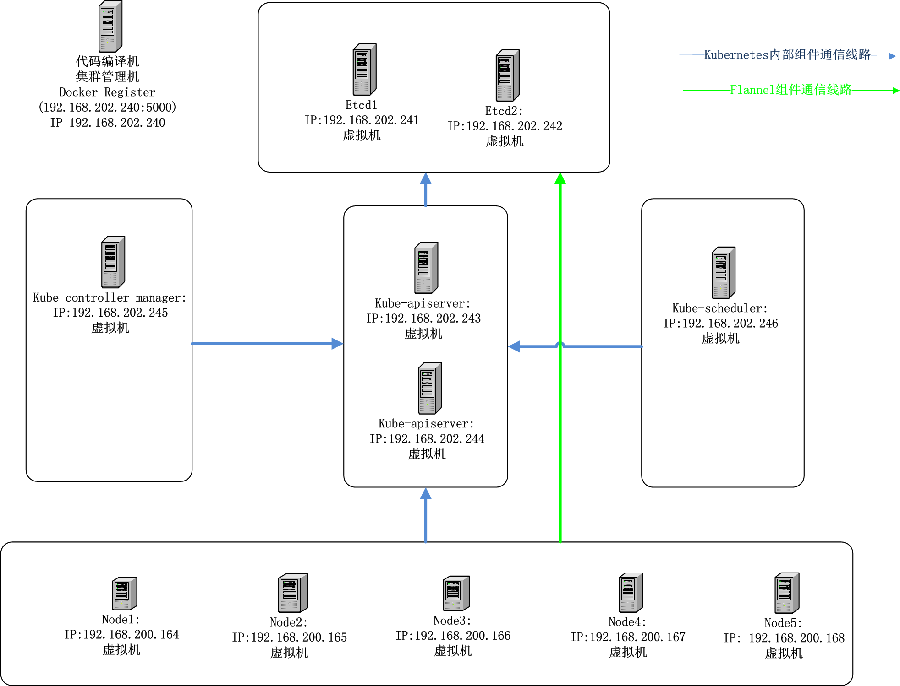

# 0_deploy

创建时间: 2015/06/26 12:35:00  修改时间: 2015/06/26 14:03:50 作者:lijiao

----

## 摘要

这里介绍下HoneyComb中是如何编排集群,并进行统一部署。

每一节开始处的v0.0.1表示后续的内容适用于版本v0.0.1。

## 拓扑

v0.0.1

>注意: 下面的部署拓扑图只是示例中使用的拓扑, 不代表生产环境中部署方式(我对各种规模的集群的部署、容灾、网络规划等均不了解, 不曾实际参与过建设实施, 憾事一件...)。

机器角色:

	192.168.202.240   1. 编译HoneyComb涉及的开源项目的代码，打包HoneyComb程序。
	                  2. 私有的Docker Register: 192.168.202.240:5000。
	                  3. 提供HoneyComb发布包的下载服务。
	                  4. 用于执行一些管理操作。
	
	192.168.202.241   1. Etcd节点1

	192.168.202.242   2. Etcd节点2

	192.168.202.243   1. Kubernetes的ApiServer1

	192.168.202.244   1. Kubernetes的ApiServer2

	192.168.202.245   1. Kubernetes的Controller Manager

	192.168.202.246   1. Kubernetes的Scheduler

	192.168.200.164   1. Kubernetes的Node
	192.168.200.165   1. Kubernetes的Node
	192.168.200.166   1. Kubernetes的Node
	192.168.200.167   1. Kubernetes的Node
	192.168.200.168   1. Kubernetes的Node

## 编排

v0.0.1

在HoneyComb的v0.0.1中, 集群的编排工作在脚本Shell/base.sh中完成, 这个脚本中详细描述每个机器的角色, 约定各项服务的端口。

	#!/bin/bash

	#########################################################
	#   deploy example: 
	#   6 machines ,ip range 192.168.202.[241-246]
		#   5 machines ,ip range 192.168.200.[164-168]

	. ./library.sh

	RUNDIR=/var/run/HoneyComb-K

	ETCD_PORT="2379"
	ETCD_PEER_PORT="2380"

	KUBELET_LISTEN="0.0.0.0"
	KUBELET_PORT="10250"

	API_LISTEN_ADDRESS="0.0.0.0"
	API_PORT="8080"

	SERVICE_ADDRESSES="172.16.0.0/16"

	FLANNEL_PREFIX="flanneld"

	#docker
	DOCKER_REGISTRYS="192.168.202.240:5000"
	DOCKER_INSECURES="0.0.0.0/0"

	#etcd Nodes
	declare -a ARRAY_ETCD_NODES
	ARRAY_ETCD_NODES[0]="192.168.202.241"
	ARRAY_ETCD_NODES[1]="192.168.202.242"

	#kubernete ApiServer Nodes
	declare  -a ARRAY_API_SERVER_NODES
	ARRAY_API_SERVER_NODES[0]="192.168.202.243"
	ARRAY_API_SERVER_NODES[1]="192.168.202.244"

	#kubernete controller manager Nodes
	declare  -a ARRAY_MANAGER_NODES
	ARRAY_MANAGER_NODES[0]="192.168.202.245"

	#kubernete  scheduler Nodes
	declare  -a ARRAY_SCHEDULER_NODES
	ARRAY_SCHEDULER_NODES[0]="192.168.202.246"

	#kubernete Nodes
	declare  -a ARRAY_KUBE_NODES
	ARRAY_KUBE_NODES[1]="192.168.200.164"
	ARRAY_KUBE_NODES[2]="192.168.200.165"
	ARRAY_KUBE_NODES[3]="192.168.200.166"
	ARRAY_KUBE_NODES[4]="192.168.200.167"
	ARRAY_KUBE_NODES[5]="192.168.200.168"

	#kubenetes master
	#TODO
	#It should be a api server list. but kubernete maybe haven't finish this work
	MASTER_SERVER="http://192.168.202.243:8080"

	App=/export/App
	Logs=/export/Logs/
	Data=/export/Data/
	Shell=/export/Shell

	EtcdDat=${Data}/etcd.dat
	DockerDat=${Data}/docker.dat

	KubeApiserver=${App}/kube-apiserver
	KubeManager=${App}/kube-controller-manager
	KubeProxy=${App}/kube-proxy
	KubeScheduler=${App}/kube-scheduler
	Kubectl=${App}/kubectl
	Kubelet=${App}/kubelet
	Flanneld=${App}/flanneld
	Etcd=${App}/etcd
	Docker=/usr/bin/docker

	#etcd addr  for client
	#ETCD_ADDR="192.168.13.86:2379,192.168.13.87:2379"
	ETCD_ADDR=`func_join_array "," "" ARRAY_ETCD_NODES ":${ETCD_PORT}"`

	#etcd addrs  used by itself
	#ETCD_PEERS="192.168.13.86:2379,192.168.13.87:2379"
	ETCD_PEERS=`func_join_array "," "" ARRAY_ETCD_NODES ":${ETCD_PEER_PORT}"`

	#etcd addrs for kubernete
	#ETCD_SERVERS="http://192.168.13.86:2379"
	ETCD_SERVERS=`func_join_array "," "http://" ARRAY_ETCD_NODES ":${ETCD_PORT}"`

	etcd_initial_cluster(){
		local str=""
		for i in ${ARRAY_ETCD_NODES[@]}
		do
			if [ "$str" == "" ];then
				str="$i=http://$i:${ETCD_PEER_PORT}" 
			else
				str="$i=http://$i:${ETCD_PEER_PORT},$str" 
			fi
		done
		echo $str
		return 0
	}
	ETCD_INITIAL_CLUSTER=`etcd_initial_cluster`

	#kubenetes nodes list
	#NODE_SERVERS="192.168.13.93,192.168.13,87"
	NODE_SERVERS=`func_join_array ","  "" ARRAY_KUBE_NODES ""`

	#kubenetes apiserver list
	#API_SERVER="http://192.168.13.86:8080"
	API_SERVERS=`func_join_array "," "http://" ARRAY_API_SERVER_NODES ":${API_PORT}"`

## 编译打包

v0.0.1

>注意运行gen.sh的机器上需要安装有Go, 且版本为1.1以上。

脚本gen.sh运行时从github上下载相关项目(kubernetes、flannel、etcd)的源码并编译制定的版本。

gen.sh中指定的项目地址与版本:

	#关联项目 Kubernetes
	Kubernetes_Url="https://github.com/GoogleCloudPlatform/kubernetes.git"
	Kubernetes_Dir="Kubernetes"
	Kubernetes_Tag="v0.18.2"

	#关联项目 flannel
	Flannel_Url="https://github.com/coreos/flannel.git"
	Flannel_Dir="Flannel"
	Flannel_Tag="v0.4.1"

	#关联项目 etcd
	Etcd_Url="https://github.com/coreos/etcd.git"
	Etcd_Dir="Etcd"
	Etcd_Tag="v2.0.11"

gen.sh运行时会从version文件中读取一个版本号,作为本次编译后的发布包的版本。

	0.0.1

gen.sh运行结束后将得到一个名为FinalPackage的目录,其中存放完整HoneyComb发布包。

	FinalPackage/
	|-- 0.0.1
	|   |-- base.sh
	|   |-- base_version
	|   |-- export.tar.gz
	|   `-- export_version
	|-- first_install.sh
	`-- lastest
	|-- base.sh
	|-- base_version
	|-- export.tar.gz
	`-- export_version

将FinalPackage中的内容直接复制到一个WebServer的文件目录后, 可以直接使用first_install.sh脚本完成首次安装。

在我自己的环境将发布包放在192.168.202.240的Web根目录下的HoneyComb目录中, 在first_install.sh中相映的配置了要安装的版本。

	#!/bin/bash
	CENTER_SERVER="http://192.168.202.240/HoneyComb/lastest/"

安装完成后, 会创建如下目录, HoneyComb的组件分布在这些目录中。

	/export/
	|-- App
	|-- Data
	|-- Logs
	|-- Shell
	|-- Version

>HoneyComb的v0.0.1中没有包含Docker,所以Kubernetes的Node上需要单独安装Docker。

## 启动

v0.0.1 

>注意: /export/Shell中的脚本的包含使用的都是相对路径,所以运行其中的脚本时,当前目录必须是/export/Shell。

在所有的机器上到/export/Shell目录中运行脚本run.sh, run.sh在运行时会自动发现自己角色, 启动相应的服务。

服务的日志将记录在/export/Logs中。

## 管理

v0.0.1 

在任意一台机器上只要可以访问Kubernetes的ApiServer，就可以使用kubectl管理这个kubernetes集群。

	$ ./kubectl -s 192.168.202.244:8080 get nodes
	NAME              LABELS    STATUS
	192.168.200.164   <none>    Ready
	192.168.200.165   <none>    NotReady
	192.168.200.166   <none>    Ready
	192.168.200.167   <none>    Ready
	192.168.200.168   <none>    Ready

## 关闭

v0.0.1 

在/export/Shell中运行stop.sh脚本就可以将这台机器上的与HoneyComb有关的服务关闭。

将所有的机器关闭后， 整个集群关闭。

## 存在的问题

v0.0.1

存在的问题很多, 例如访问控制、容灾等等, 将随着了解的逐步深入和知识经验的积累逐渐完善。

## 文献
