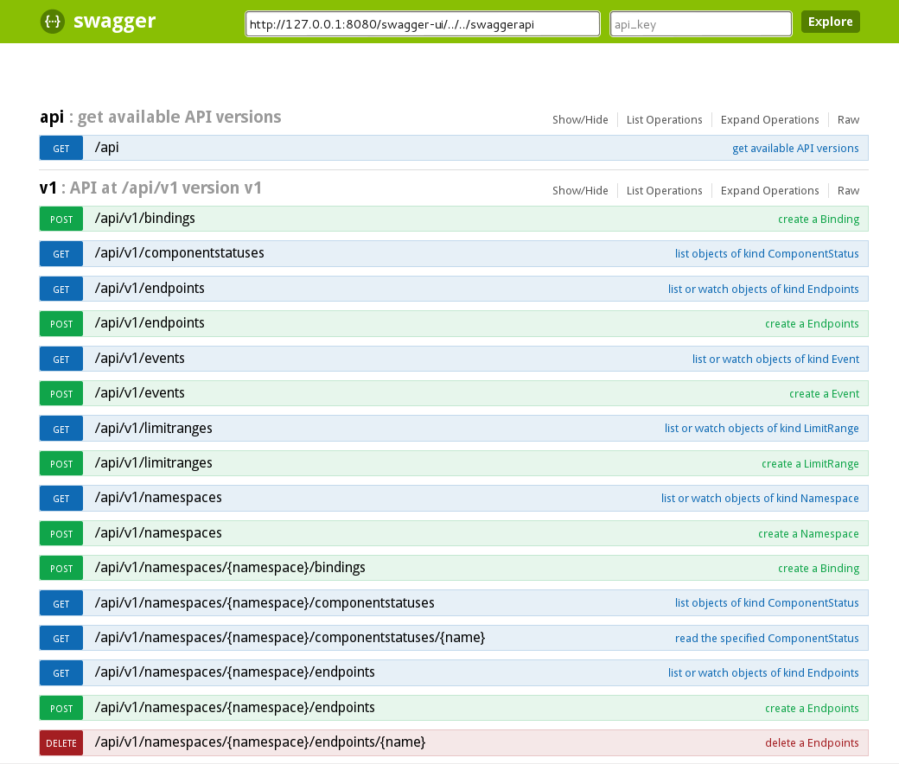

# 5_example_authn&authz

创建时间: 2015/09/07 18:05:54  修改时间: 2015/09/12 12:10:08 作者:lijiao

----

## 摘要

认证(authn)和授权(authz)是两个独立的过程。

k8s v1.0 象征性地提供了这两个功能，可以开发插件适配自己的认证服务和授权服务。

## 认证(authn)

[authentication](https://github.com/kubernetes/kubernetes/blob/v1.0.0/docs/authentication.md)

源码: pkg/apiserver/authn.go 

k8s支持三种认证方式:

	--client-ca-file=SOMEFILE      ca证书, 客户端提供的ca证书中的common name作为用户名
	--token-auth-file=SOMEFILE     tocken, 格式: token,user name, user uid, 
	                               http头中包含: Authorization: Bearer SOMETOKEN
	--basic-auth-file=SOMEFILE     basic auth, 格式: password, user name, userid
	                               http头中包含: Authorization: Basic BASE64ENCODEDUSER:PASSWORD

针对k8s v1.0, ca的方式更好一些, 增加新用户的时候不需要重启apiserver。

[authx](./authx)中制作了一个ca证书和几个用户证书。

	admin_cluster:    k8s集群管理员, 管理组成k8s集群的计算节点
	admin_project:    k8s项目管理员, 管理运行在k8s中的应用
	user_guest:       游客, 只能查看游客组中集群的相关信息
	user_alice:       用户alice, 只能查看alice的namespace
	user_bob:         用户bob, 只能查看bob的namespace

## 授权(authz)

[authorization](https://github.com/kubernetes/kubernetes/blob/v1.0.0/docs/authorization.md)

>k8s v1.0自带的授权机制, 在变更授权策略时需要重启apiserver。

源码路径: pkg/apiserver/authz.go

k8s支持三种授权方式:

	--authorization_mode=AlwaysDeny    
	--authorization_mode=AlwaysAllow   <-- 默认设置
	--authorization_mode=ABAC          <-- 依据属性进行访问控制: Attribute-Based Access Control

### ABAC授权
	
只有ABAC模式可以针对用户进行授权。ABAC的授权策略文件: 

	--authorization_policy_file=SOME_FILENAME

k8s v1.0中ABAC授权策略有四个维度: user、readonly、resource、namespace

	user:        用户名
	readonly:    用户是否只能进行读操作
	resource:    允许用户访问资源类型
	namespace:   允许用户访问的Namespace

>源码中还有group一项, 暂时还没了解k8s是怎样确定用户组的。

一条授权策略中没有设定的维度默认为允许。例如:

	{"readonly": true, "resource": "pods"}  --> 所有的用户都只能读取任意Namespace中的pods。

	{"resource": "pods"}                    --> 所有的用户都可以操作任意Namespace中的pods。

	{"readonly": "true"}                    --> 所有的用户只能读取所有的资源

当存在多条策略的时候, 只要一条策略允许该操作，就会授权为允许，即使其它的策略设置为不允许。

授权策略对应的结构, pkg/auth/authorizer/abac/abac.go:policy

	type policy struct {
		User  string `json:"user,omitempty"`
		Group string `json:"group,omitempty"`
		// TODO: add support for robot accounts as well as human user accounts.
		// TODO: decide how to namespace user names when multiple authentication
		// providers are in use. Either add "Realm", or assume "user@example.com"
		// format.

		// TODO: Make the "cluster" Kinds be one API group (minions, bindings,
		// events, endpoints).  The "user" Kinds are another (pods, services,
		// replicationControllers, operations) Make a "plugin", e.g. build
		// controller, be another group.  That way when we add a new object to a
		// the API, we don't have to add lots of policy?

		// TODO: make this a proper REST object with its own registry.
		Readonly  bool   `json:"readonly,omitempty"`
		Resource  string `json:"resource,omitempty"`
		Namespace string `json:"namespace,omitempty"`

		// TODO: "expires" string in RFC3339 format.

		// TODO: want a way to allow some users to restart containers of a pod but
		// not delete or modify it.

		// TODO: want a way to allow a controller to create a pod based only on a
		// certain podTemplates.
	}

### ABAC授权过程

启动apiserver的时候指定ABAC的授权策略文件, apiserver完成加载。

apiserver收到http请求时, 从req中获取属性信息:

	pkg/apiserver/handlers.go: 
		func (r *requestAttributeGetter) GetAttribs(req *http.Request)))authorizer.Attributes 

	user:      从会话的context中的获取
	readonly:  如果请求的方法是"Get", readonly是true
	resource:  从url中获取
	namespace: 从url中获取

apiserver将从req中获取的属性与授权策略进行匹配:

	pkg/auth/authorizer/abac/abac.go:

	// Authorizer implements authorizer.Authorize
	func (pl policyList) Authorize(a authorizer.Attributes) error {
		for _, p := range pl {
			if p.matches(a) {
				return nil 
			}
		}
		return errors.New("No policy matched.")
			// TODO: Benchmark how much time policy matching takes with a medium size
			// policy file, compared to other steps such as encoding/decoding.
			// Then, add Caching only if needed.
	}

	func (p policy) matches(a authorizer.Attributes) bool {
		if p.subjectMatches(a) {
			if p.Readonly == false    (p.Readonly == a.IsReadOnly()) {
				if p.Resource == ""    (p.Resource == a.GetResource()) {
					if p.Namespace == ""    (p.Namespace == a.GetNamespace()) {
						return true
					}
				}
			}
		}
		return false
	}

	func (p policy) subjectMatches(a authorizer.Attributes) bool {
		if p.User != "" {  
			// Require user match
			if p.User != a.GetUserName() {
				return false
			}
		}
		if p.Group != "" {
			// Require group match
			for _, group := range a.GetGroups() {
				if p.Group == group {
					return true
				}
			}
			return false
		}
		return true
	}

根据匹配结果决定是否拒绝请求。

### Resources

k8s v1.0中提供的resource, 可以通过到rest api查找, rest api遵循如下格式:

	/PREFIX/VERSION/namespaces
	/PREFIX/VERSION/namespaces/{namespace}
	/PREFIX/VERSION/namespaces/{namespace}/{resource}
	/PREFIX/VERSION/namespaces/{namespace}/{resource}/{resourceName}
	/PREFIX/VERSION/{resource}
	/PREFIX/VERSION/{resource}/{resourceName}

启动apiserver后，可以直接访问/swagger-ui/查看apiserver提供的所有的api。

k8s v1中提供的resources:

	bindings
	componentstatuses
	endpoints
	events
	limitranges
	namespaces              <-- namespace本身也是resource
	persistentvolumeclaims
	pods
	podtemplates
	replicationcontrollers
	resourcequotas
	secrets
	serviceaccounts
	services
	nodes

### 示例策略

	//cluster管理员只能管理计算节点
	{"user":"admin_cluster", "resource": "nodes"}      

	//project管理员只能管理集群上的services
	{"user":"admin_project", "resource": "services"}

	//用户只能在自己的namespace中做任何事情
	{"user":"user_alice", "namespace": "user_alice"}
	{"user":"user_bob",   "namespace": "user_bob"}
	{"user":"user_guest", "readonly": true, "namespace":"user_guest"}

	//k8s自身的组件遵循最小权限的原则
	{"user":"kube-system_scheduler", "readonly": true, "resource": "pods"}
	{"user":"kube-system_scheduler", "resource": "bindings"}
	{"user":"kube-system_kubelet", "readonly": true, "resource": "pods"}
	{"user":"kube-system_kubelet", "readonly": true, "resource": "services"}
	{"user":"kube-system_kubelet", "readonly": true, "resource": "endpoints"}
	{"user":"kube-system_kubelet", "resource": "events"}

## ServiceAccounts

[ServiceAccounts](https://github.com/kubernetes/kubernetes/blob/v1.0.0/docs/service_accounts.md)

[ServiceAccounts Admin](https://github.com/kubernetes/kubernetes/blob/v1.0.0/docs/service_accounts_admin.md)

>文档中只提到以后会对ServiceAccount设置访问控制, 详情如何还未知。 这部分内容的研究暂且搁置一下。 2015-09-12 12:04:58

前面的两大章节是对k8s外部的用户的认证和授权。运行在k8s中的Pod中进程也会访问k8s的apiserver。

Pod中的进程提交的认证资料是ServiceAccounts。ServiceAccounts是k8s中一种资源, 创建Pod的时候可以为Pod设置一个ServiceAccount。

k8s提供的一些插件例如kube-ui、dns等是作为service运行在k8s中的, 这些组件会访问apiserver, 需要凭借ServiceAccount。

用户自己开发了一个用于监控其它的k8s应用的应用, 这个应用可以运行在k8s中, 这个应用访问apiserver时也需要凭借ServiceAccounts。

## 文献
