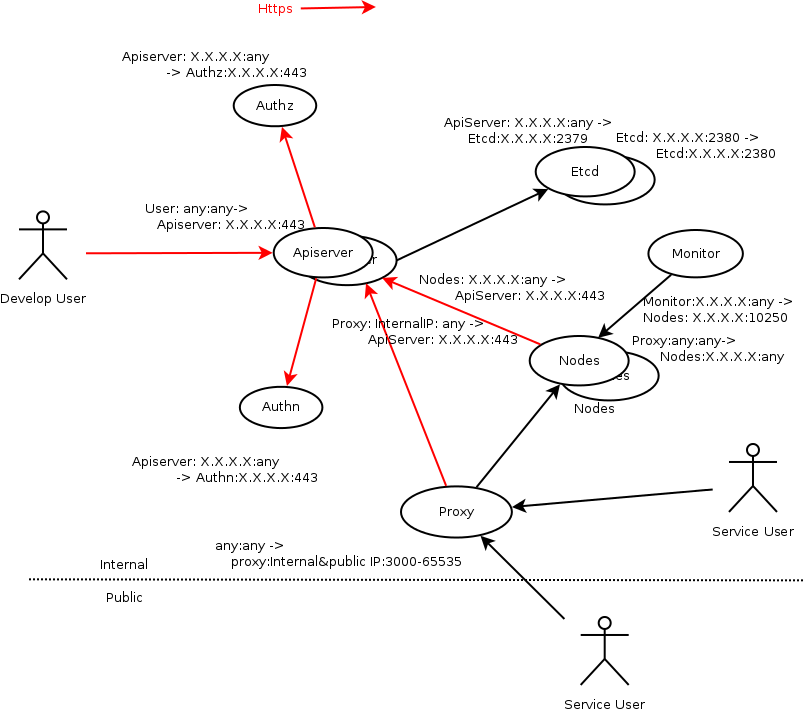

# 6_example_encryption
创建时间: 2015/09/26 23:17:04  修改时间: 2015/09/27 00:14:21 作者:lijiao

----

## 摘要

k8s自身的安全性非常重要，这一点毫无疑问。

## 服务提供者

k8s中有apiserver、kubelet和scheduler(插件)三个组件对外提供服务。

关系如图片:

>Authz和Authn是规划的独立的认证和授权系统, Nodes是运行有kubelet的宿主机, Monitor是规划的监控系统。

需要保护这三个组件的服务不被越权使用, 通信内容不被截获。

## apiserver

apiserver涉及到三套证书:

	1. 自身对外服务的加密使用的证书和私钥
	2. 访问kubelet的服务使用的证书和私钥, 签署kubelet的证书的根证书
	3. 用于验证用户身份的根证书

[配置文件kube-apiserver.sh](../Config/allinone-secure/Shell/kube-apiserver/kube-apiserver.sh)中给出了配置示例。

自身使用的证书:

	# api https
	Configs[tls-cert-file]="--tls-cert-file=./cert-api/cert.pem"
	Configs[tls-private-key-file]="--tls-private-key-file=./cert-api/key.pem"

与kubelet通信使用的证书:

	# kubelet https
	Configs[kubelet-https]="--kubelet-https=true"
	Configs[kubelet-certificate-authority]="--kubelet-certificate-authority=./cert-kubelet/ca.pem"
	Configs[kubelet-client-certificate]="--kubelet-client-certificate=./cert-kubelet/cert.pem"
	Configs[kubelet-client-key]="--kubelet-client-key=./cert-kubelet/key.pem"

验证用户身份使用的证书(参加之前的关于认证和授权的文章):

	# authn
	Configs[client-ca-file]="--client-ca-file=./cert-authn/ca.pem"

另外, k8s 1.0中apiserver强制开启一个不安全的服务端口(默认8080), 这个端口使用http通信, 并且不会做任何认证和授权, 任何人只要能访问到这个端口, 就可以做任何事情。k8s文档中提到用防火墙等方式保证这个端口不会被随意访问。个人认为，在做安全规划的时候，不能把希望全部寄托在网络的隔离性上,否则一旦被攻入, 如入无人之境。

>k8s 1.0中的非安全端口还没关闭开关, 强制开启。

## kubelet

kubelet具有双重身份, 首先它是apiserver的用户之一, 会使用自己的用户证书访问apiserver的服务, 并受到授权策略的制约, 然后它自身也会对外提供服务，apiserver以及监控系统会通过kubelet的服务端口获得相关的信息。

[配置文件kube-kubelet](./Config/allinone-secure/Shell/kube-kubelet/kube-kubelet.sh)

	Configs[tls-cert-file]="--tls-cert-file=./cert-self/cert.pem"
	Configs[tls-private-key-file]="--tls-private-key-file=./cert-self/key.pem"

>注意需要把签署kubelet的的服务证书的根证书告知apiserver。

## scheduler

scheduler是k8s提供的一个调度插件, 这个插件作为一个独立的程序运行，会开启一个端口对外提供服务(默认10251)。

k8s 1.0中的scheduler的服务采用http, 没有加密、认证和授权等安全机制。

这个scheduler只是一个示例, 实战的时候肯定是需要开发自己的调度插件的, 到时候需要注意做好防护。

## 证书制作示例

x509的证书制作比较繁琐, 而且k8s中用到了三套证书, 很容易混淆。

[Authnauthz](../AuthnAuthz/allinone-secure)中提供了一套制作方案。

## 问题

k8s 1.0开启ABAC授权模式的时候, 使用kubectl访问安全的服务端口时候会失败(其它组件: master、kubelet、porxy等访问apiserver时不存在这个问题):

	error: couldn't read version from server: the server does not allow access to the requested resource'

这是一个已知的问题: [kubectl does not work with namespace authorization](https://github.com/kubernetes/kubernetes/issues/13097)

## 文献

