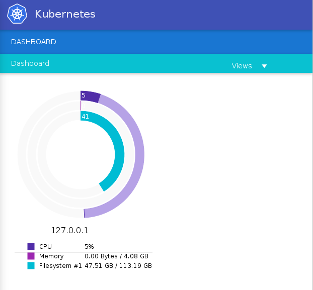

# All-in-One 和 Ui
创建时间: 2015/08/31 17:02:07  修改时间: 2015/08/31 23:49:07 作者:lijiao

----

## 摘要

前段时间一头扎入了Kubernetes apiserver的代码里，同时又要完成其它的工作, 导致好久没能从代码里出来。

这几天从代码里爬出来后发现原先部署k8s集群的机器被用来做这事那事的，上面的东西已经有些乱了。所以All in one 还是很有必要的。

## All-in-One

之前在部署脚本方面花费的不少功夫这时候体现出了价值，只需要在Config目录中新建一个allinone目录,在base.sh中重新配置一下即可。

	$ tree Config/
	Config/
	|-- allinone
	|   |-- base.sh
	|   |-- config
	|   |-- flannel.json
	|   `-- machines.lst
	`-- cluster1
	    |-- base.sh
	    |-- config
	    |-- flannel.json
	    `-- machines.lst

[allinone/base.sh](../Config/allinone/base.sh):

	...省略...

	#docker
	DOCKER_REGISTRYS="127.0.0.1:5000"
	DOCKER_INSECURES="0.0.0.0/0"
	
	#registry Nodes
	ARRAY_REGISTRY_NODES[0]="127.0.0.1"
	
	#etcd Nodes
	declare -a ARRAY_ETCD_NODES
	ARRAY_ETCD_NODES[0]="127.0.0.1"
	
	#kubernete ApiServer Nodes
	declare  -a ARRAY_API_SERVER_NODES
	ARRAY_API_SERVER_NODES[0]="127.0.0.1"
	
	#kubernete controller manager Nodes
	declare  -a ARRAY_MANAGER_NODES
	ARRAY_MANAGER_NODES[0]="127.0.0.1"
	
	#kubernete  scheduler Nodes
	declare  -a ARRAY_SCHEDULER_NODES
	ARRAY_SCHEDULER_NODES[0]="127.0.0.1"
	
	#kubernete Nodes
	declare  -a ARRAY_KUBE_NODES
	ARRAY_KUBE_NODES[1]="127.0.0.1"
	
	#kubenetes master
	#TODO
	#It should be a api server list. but kubernete maybe haven't finish this work
	MASTER_SERVER="http://127.0.0.1:8080"

	...省略...

然后执行release.sh脚本，选择allinone之后，就开始编译打包:

	$ ./release.sh 
	  allinone
	  cluster1
	Choose the Cluster:allinone  <-输入allinone

最后在Release目录下得到新的allinone安装包:

	Release/
	|-- allinone-0.0.1--CentOS-7.1.1503--HoneyComb-0.0.2.sha1sum
	|-- allinone-0.0.1--CentOS-7.1.1503--HoneyComb-0.0.2.tar.gz
	|-- cluster1-0.0.2--Debian--HoneyComb-v0.0.2.sha1sum
	`-- cluster1-0.0.2--Debian--HoneyComb-v0.0.2.tar.gz

解压后, 将文件复制到/export目录下

	/bin/cp -rf allinone-0.0.1--CentOS-7.1.1503--HoneyComb-0.0.2/export/*   /export/

到/export/Shell中执行run.sh之后，allinone就开始运行了。

	# ./run.sh 
	/export/App/etcd is running
	Deleting Flanneld old Config ...
	{"action":"delete","node":{"key":"/flanneld","dir":true,"modifiedIndex":1785,"createdIndex":1359},"prevNode":{"key":"/flanneld","dir":true,"modifiedIndex":1359,"createdIndex":1359}}
	Putting Flanneld New Config ...
	{"action":"set","node":{"key":"/flanneld/config","value":"{
	\"Network\":\"172.16.0.0/16\",
	\"Subnetlen\":24,
	\"SubnetMin\":\"172.16.100.100\",
	\"SubnetMax\":\"172.16.254.254\",
	\"Backend\":{
	\"Type\":\"udp\",
	\"Port\":7890
	}
	}","modifiedIndex":1786,"createdIndex":1786}}
	/export/App/flanneld is running
	/usr/bin/docker is running
	/export/App/kube-apiserver is running
	/export/App/kube-controller-manager is running
	/export/App/kube-scheduler is running
	/export/App/kubelet is running
	/export/App/kube-proxy is running
	/export/App/registry is running

k8s依赖的镜像需要事先在registry中准备好, 通过查看kubelet的日志可以知道缺少哪个镜像, 例如:

	Error: image kubernetes/pause:latest not found

>2015-08-31 17:19:18 安装的机器上需要事先安装好docker， 且docker命令位于/usr/bin/目录中。以后有时间会把docker也集成到HoneComb中。

## UI

在阅读源码的时候发现apiserver有一个UI服务的地址如下:

	http://127.0.0.1:8080/ui/   <--- 127.0.0.1:8080是apiserver的服务地址)

该地址被重定向到: 

	http://127.0.0.1:8080/api/v1/proxy/namespaces/kube-system/services/kube-ui/#/dashboard/

在[文档ui](https://github.com/kubernetes/kubernetes/blob/release-1.0/docs/user-guide/ui.md)中得知k8s提供了kube-ui服务的创建文件: [addons: kube-ui](https://github.com/kubernetes/kubernetes/tree/release-1.0/cluster/addons/kube-ui)

创建kube-ui服务的方式在k8s的文档中已经说的很明白了，这里不赘述。[doc/kube-ui](./kube-ui)中是适用于all-in-one的kube-ui。

	cd kube-ui
	./build.sh
	../../kubectl.sh create -f kube-ui-rc.yaml
	../../kubectl.sh create -f kube-ui-svc.yaml

查看创建的结果(注意查看时指定namespace):

	$../../Tools/kubectl.sh --namespace=kube-system get pod
	NAME               READY     STATUS    RESTARTS   AGE
	kube-ui-v1-inlcf   1/1       Running   0          8m

	$../../Tools/kubectl.sh --namespace=kube-system get rc
	CONTROLLER   CONTAINER(S)   IMAGE(S)                               SELECTOR                     REPLICAS
	kube-ui-v1   kube-ui        127.0.0.1:5000/honeycomb/kube-ui:dev   k8s-app=kube-ui,version=v1   1

	$../../Tools/kubectl.sh --namespace=kube-system get svc
	NAME      LABELS                                                                         SELECTOR          IP(S)            PORT(S)
	kube-ui   k8s-app=kube-ui,kubernetes.io/cluster-service=true,kubernetes.io/name=KubeUI   k8s-app=kube-ui   172.16.118.164   80/TCP

这时候访问127.0.0.1:8080/ui/就可以看到界面了。

>需要留意的是重定向的地址中有一个"proxy"。我看到这个地址后恍然大悟：原来代码中遇到的proxy是这样用的，k8s充当了用户与kube-ui服务之间的代理。

## 文献
